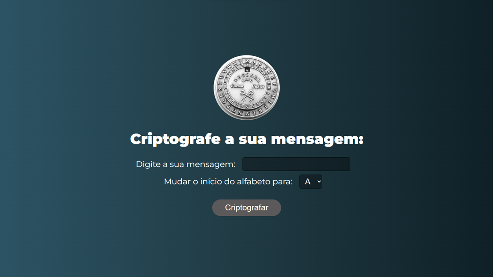
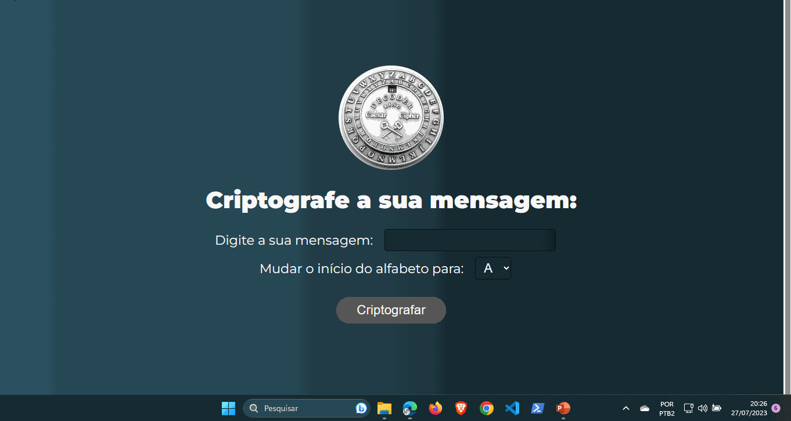

# Elevador

</img>
</img>

## 🤔 O que é este projeto

Este projeto é uma página feita com HTML, CSS e Javascript para demonstrar a cifra de Cesar. Ele possui um campo de input para inserir uma mensagem que será criptografada conforme escolha da letra inicial. Quando apertado no botão “Criptografar” vai aparecer a mensagem de forma criptografada com outras letras. Este foi mais um projeto de integração entre as tecnologias citadas acima com a DOM do curso Formação DEV.

## 🖥️ Como rodar este projeto
Para rodar o projeto basta dar dois cliques no arquivo *index.html* uma vez que a pasta do projeto esteja aberta no sistema de arquivos do seu sistema operacional.

Alternativamente você também pode utilizar a extensão [Live Server](https://marketplace.visualstudio.com/items?itemName=ritwickdey.LiveServer) da IDE Visual Studio Code para rodar o projeto.

## 🕹️ Como usar este projeto
Uma vez que a aplicação esteja rodando, você digita uma mensagem no campo “Digite a sua mensagem”.

Para dar início a criptografia da mensagem escolhe uma letra para iniciar o processo no seletor "Mudar o início do alfabeto para ...".

Por fim, clica no botão “Criptografar” vai aparecer a mensagem de forma criptografada com outras letras. 

## ⚠️ Observação
Como a cifra de Cesar só possuia as letra não é possível criptografar números, acentos ou caracteres especiais.

## ⚙️ Tecnologias usadas no projeto
- 
- 
- 

## 🗒️ Features do projeto
<!-- caracteristicas do projeto resumidas mas não é necessaria-->
- 1 campo de input onde o usuário insere seu texto a ser criptografado.
- 1 seletor de qual letra o usuário quer que inicie a criptografia. 
- 1 botão para criptografar. 
- 1 mostrador que vai aparecer apenas quando trouxer a mensagem criptografada.

## 🗂️ Como este projeto está organizado
<!-- dar uma ideais geral nãoprecisa ser detalhista -->
Na pasta raiz do projeto existem três arquivos de código e uma pasta:
- index.html -> contém o html da aplicação
- estilo.css -> contém o arquivo de estilos da aplicação
- script.js -> contém os códigos javascript da aplicação para fazer a criptografia e manipular o HTML
- Pasta assets -> com a imagem da cifra de Cesar

## 👩‍💻 Como este projeto foi implementado
<!-- Aqui pode ser usado uma linguagem, mas técnica e não escrever demais-->
Este projeto foi implementado com HTML, CSS e JavaScript.

Para iniciar a lógica do nosso programa criamos um array “alfabeto” com as letras aptas a criptografar. 

No javascript obtemos através da DOM via getElementsById os elementos inseridos na página: o texto, o deslocamento e clicar no botão.

Adicionamos um evento addEventListener ao botão de “Criptografar” para ocorrer uma espera antes da criptografia ser entregue ao usuário em forma de um mostruário que aparecerá na tela.

Foi criada uma função “cifrar” que recebia a mensagem inserida por meio da caixa de input “Digite a sua mensagem”. 

Primeiramente ao receber este texto colocamos ele em uma variável que converte todas as letras em maiúsculo e tira todos os espaços em branco. 

A seguir criamos um array vazio para guardar a mensagem criptografada. 

Para percorrer toda a mensagem criamos um laço “FOR” obtém o índice das letras que seriam alteradas. 

Para se evitar uma quebra, seja por inserir números ou caracteres especiais, colocamos dentro do laço “FOR” uma condição “IF ELSE”, onde após se conhecer o índice da letra e este ter sua condição como verdadeira, ou seja,  está contido dentro dentro do array “alfabeto” este índice será alterado por meio de uma função (letraPorIndice)para haver um deslocamento para uma outra letra e por conseguinte ser colocado dentro do array vazio “texto criptografado”.

Caso a condição seja falsa, ou seja, sejam inseridos números ou caracteres especiais, o respectivo caractere é inserido array “texto criptografado” sem qualquer alteração.

Por fim, criamos a função “letraPorIndice” onde após a letra ser reconhecida dentro do array "alfabeto", seu índice era alterado para se obter uma nova letra e assim construir a criptografia da mensagem que seria inserida no array “textoCriptografado” e por conseguinte devolvido ao usuário no mostruário com as letras criptografadas.

## ⭐ Dependências principais
<!-- API's importantes-->
Não existe dependências no projeto.

## 🆘 Precisa de ajuda?
Você pode me contatar através desses contatos:

-------

Feito com 🧑‍💻 por Marcelo

